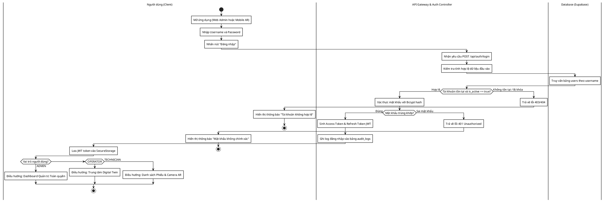
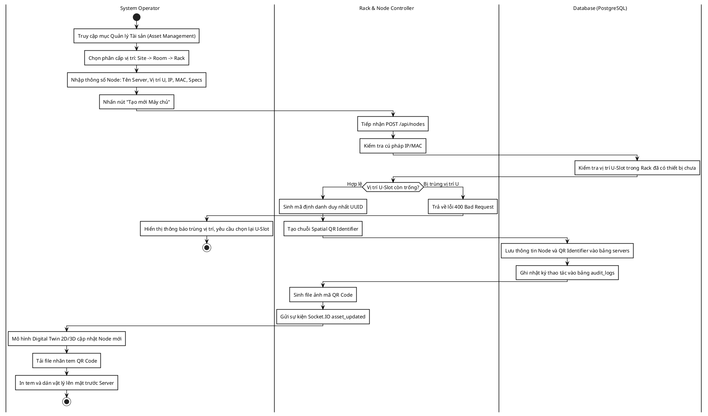
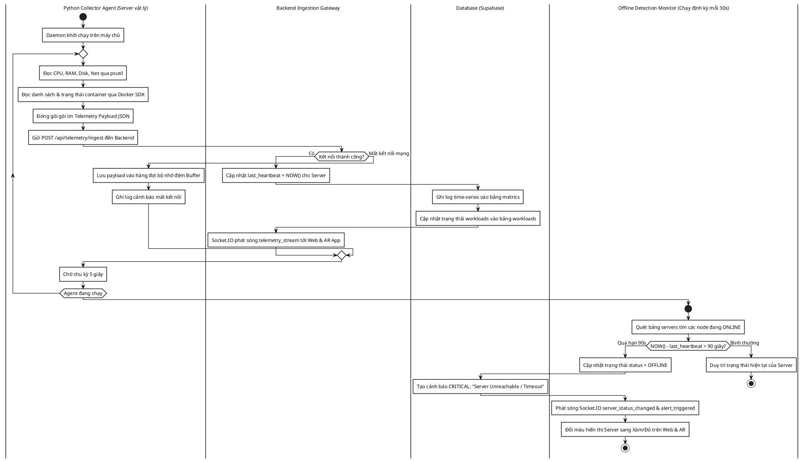
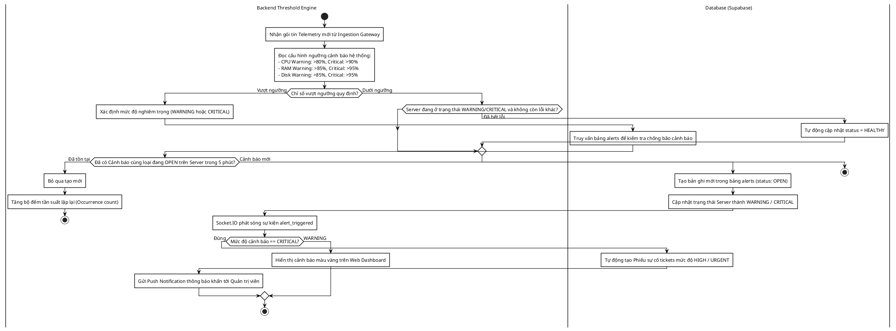
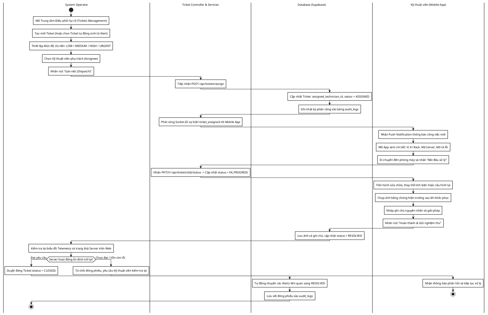
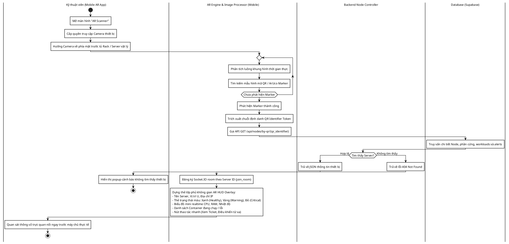
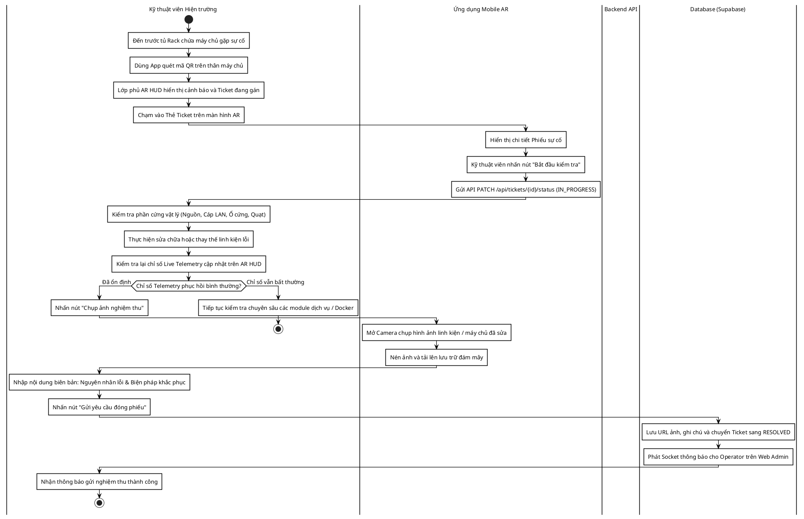
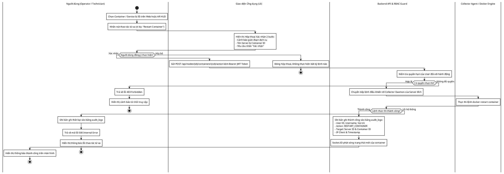
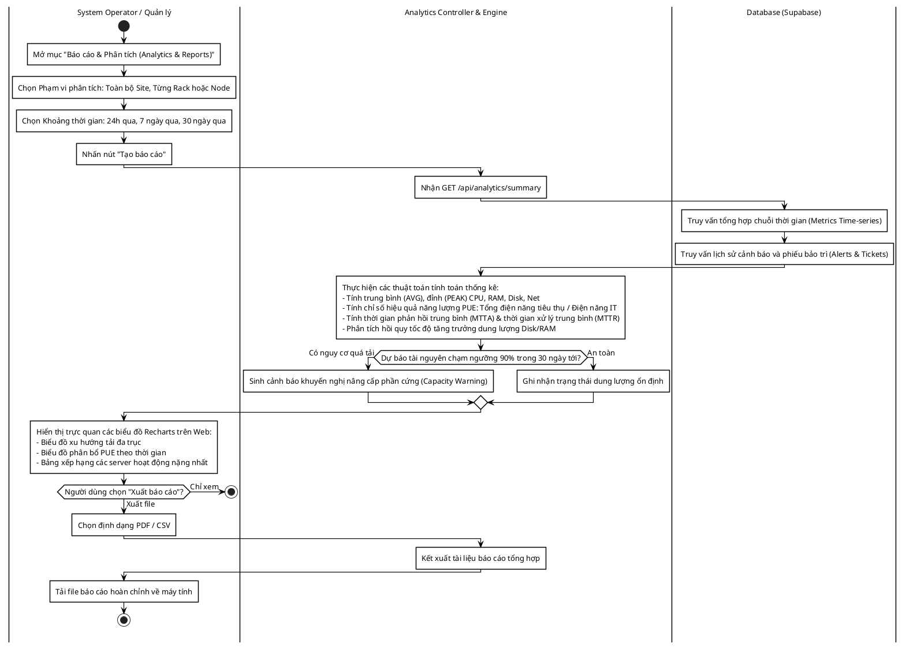
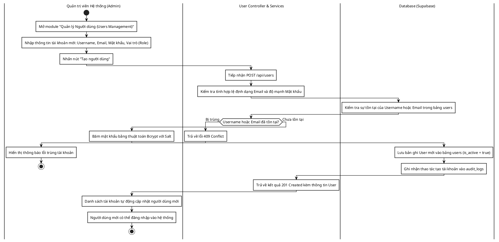

# TỔNG HỢP MÃ NGUỒN ACTIVITY DIAGRAM (PLANTUML CHUẨN KỸ THUẬT CHO DRAW.IO)
## HỆ THỐNG GIÁM SÁT VÀ BẢO TRÌ CƠ SỞ HẠ TẦNG TÍCH HỢP AR (AR-IMMS)

> **Phong cách vẽ:** Chuẩn kỹ thuật (Engineering / Clean Monochrome), **đường nối vuông góc thẳng tắp (Ortho)**, **không bo tròn góc (Sharp 90°)**, **viền đen rõ nét**, không bóng đổ, bố cục tự nhiên và chỉn chu như vẽ tay trên Draw.io / Visio.

---

### 📌 HƯỚNG DẪN IMPORT VÀO DRAW.IO:
1. Mở trang web [draw.io](https://app.diagrams.net/).
2. Trên thanh menu chọn: **Arrange** (Sắp xếp) -> **Insert** (Chèn) -> **Advanced** (Nâng cao) -> **PlantUML...**
3. Sao chép (Copy) toàn bộ đoạn mã trong khối `@startuml ... @enduml` của biểu đồ bạn muốn vẽ và dán vào ô nhập liệu.
4. Nhấn **Insert** (Chèn).

---

## MỤC LỤC CÁC BIỂU ĐỒ HOẠT ĐỘNG
- [AD-01: Quy trình Đăng nhập & Phân quyền Người dùng (Auth & RBAC)](#ad-01-quy-trình-đăng-nhập--phân-quyền-người-dùng)
- [AD-02: Quy trình Khai báo Tài sản & Ánh xạ Mã QR Không gian (Asset & QR Binding)](#ad-02-quy-trình-khai-báo-tài-sản--ánh-xạ-mã-qr-không-gian)
- [AD-03: Quy trình Thu thập Telemetry & Phát hiện Máy chủ Mất kết nối (Heartbeat Engine)](#ad-03-quy-trình-thu-thập-telemetry--phát-hiện-máy-chủ-mất-kết-nối)
- [AD-04: Quy trình Đánh giá Ngưỡng & Tự động Kích hoạt Cảnh báo (Threshold & Alert Engine)](#ad-04-quy-trình-đánh-giá-ngưỡng--tự-động-kích-hoạt-cảnh-báo)
- [AD-05: Quy trình Quản lý & Điều phối Phiếu Bảo trì (Ticket Lifecycle Management)](#ad-05-quy-trình-quản-lý--điều-phối-phiếu-bảo-trì)
- [AD-06: Quy trình Quét Camera AR & Dựng Lớp phủ HUD Không gian (AR Scanner & HUD Overlay)](#ad-06-quy-trình-quét-camera-ar--dựng-lớp-phủ-hud-không-gian)
- [AD-07: Quy trình Kỹ thuật viên Xử lý Sự cố Hiện trường (On-site Maintenance Execution)](#ad-07-quy-trình-kỹ-thuật-viên-xử-lý-sự-cố-hiện-trường)
- [AD-08: Quy trình Thao tác Từ xa An toàn & Ghi Nhật ký Kiểm toán (Safe Remote Action & Audit Trail)](#ad-08-quy-trình-thao-tác-từ-xa-an-toàn--ghi-nhật-ký-kiểm-toán)
- [AD-09: Quy trình Báo cáo Hiệu năng, Dự báo Dung lượng & PUE (Analytics & Capacity Planning)](#ad-09-quy-trình-báo-cáo-hiệu-năng-dự-báo-dung-lượng--pue)
- [AD-10: Quy trình Quản lý Tài khoản & Phân quyền Quản trị (User Management Admin CRUD)](#ad-10-quy-trình-quản-lý-tài-khoản--phân-quyền-quản-trị)

---

### AD-01: Quy trình Đăng nhập & Phân quyền Người dùng

---

### AD-02: Quy trình Khai báo Tài sản & Ánh xạ Mã QR Không gian

---

### AD-03: Quy trình Thu thập Telemetry & Phát hiện Máy chủ Mất kết nối

---

### AD-04: Quy trình Đánh giá Ngưỡng & Tự động Kích hoạt Cảnh báo

---

### AD-05: Quy trình Quản lý & Điều phối Phiếu Bảo trì

---

### AD-06: Quy trình Quét Camera AR & Dựng Lớp phủ HUD Không gian

---

### AD-07: Quy trình Kỹ thuật viên Xử lý Sự cố Hiện trường

---

### AD-08: Quy trình Thao tác Từ xa An toàn & Ghi Nhật ký Kiểm toán

---

### AD-09: Quy trình Báo cáo Hiệu năng, Dự báo Dung lượng & PUE

---

### AD-10: Quy trình Quản lý Tài khoản & Phân quyền Quản trị

