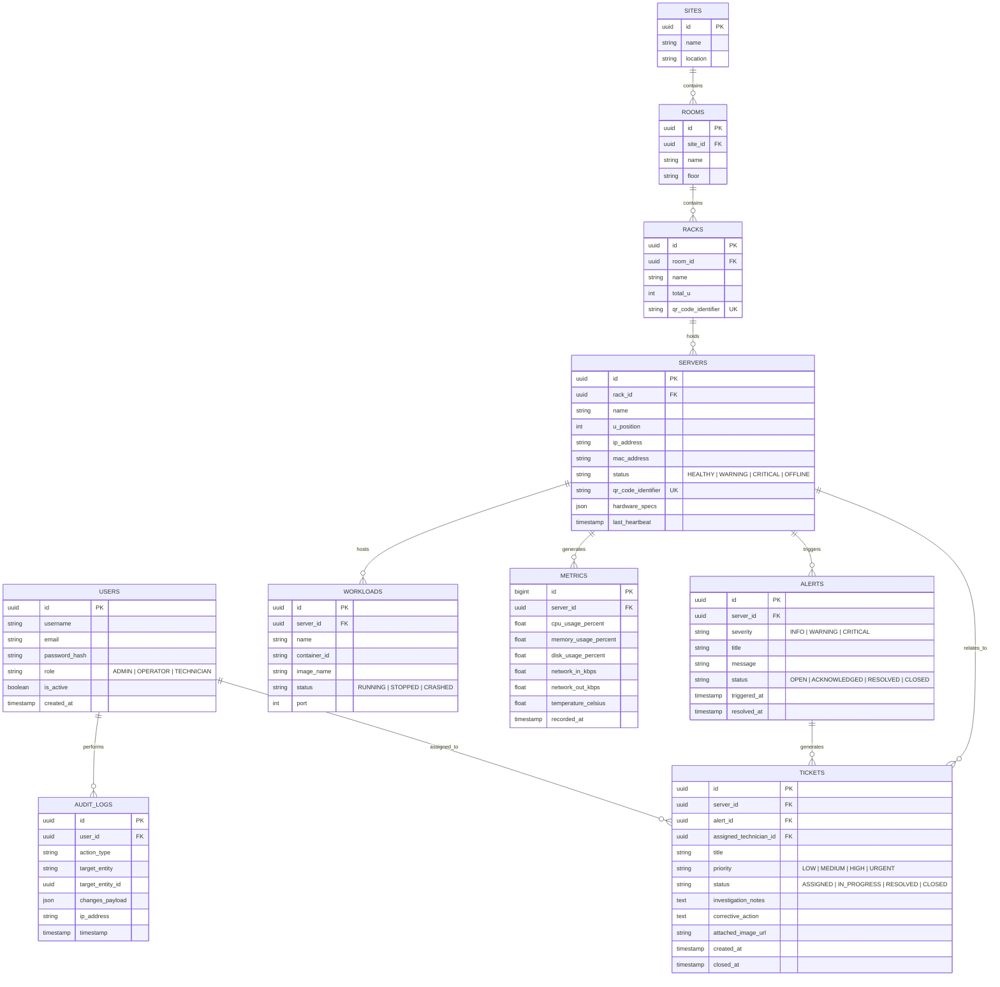

# KẾ HOẠCH PHÂN RÃ CHỨC NĂNG & THIẾT KẾ KIẾN TRÚC HỆ THỐNG
## DỰ ÁN: HỆ THỐNG GIÁM SÁT VÀ BẢO TRÌ CƠ SỞ HẠ TẦNG TÍCH HỢP THỰC TẾ TĂNG CƯỜNG (AR-IMMS)
*(AR-Integrated Infrastructure Monitoring and Maintenance System)*

---

## 1. TỔNG QUAN VÀ MỤC TIÊU DỰ ÁN

### 1.1. Bối cảnh & Vấn đề giải quyết
Trong các trung tâm dữ liệu (Data Center / Server Room), việc giám sát thường tách rời giữa **không gian số (Dashboard/Metrics)** và **không gian vật lý (Tủ Rack/Máy chủ vật lý)**. 
Khi sự cố xảy ra:
- Kỹ thuật viên mất nhiều thời gian định vị máy chủ lỗi giữa hàng trăm server giống hệt nhau.
- Thiếu thông tin trực tiếp (live metrics, logs, lịch sử bảo trì) ngay tại vị trí máy chủ vật lý.
- Quy trình ghi nhận sự cố, gán việc và nghiệm thu còn thủ công.

### 1.2. Giải pháp AR-IMMS
Xây dựng hệ sinh thái giám sát và bảo trì toàn diện:
1. **Digital Twin 3 cấp độ:** Mô hình hóa phân tầng `Site -> Room -> Rack -> Server/Node -> Container/Workload`.
2. **Thu thập Telemetry thời gian thực:** Agent thu thập dữ liệu hệ thống (CPU, RAM, Disk, Net, Docker) mỗi 5s, tự động phát hiện máy chủ offline (>90s).
3. **Cảnh báo & Quản lý Sự cố (Alerting & Ticketing):** Tự động phát hiện vượt ngưỡng (Threshold), kích hoạt quy trình xử lý vé sự cố (Ticket Lifecycle).
4. **Mobile AR Application (Thực tế tăng cường):** Quét mã QR/ArUco dán trên máy chủ để hiển thị lớp phủ AR (HUD Overlay) live telemetry, logs, và thực hiện thao tác bảo trì tại chỗ.
5. **Báo cáo, Phân tích & Nhật ký (Audit Trail):** Thống kê tải, PUE/điện năng, lịch sử bảo trì, kiểm toán hành vi người dùng.

---

## 2. KIẾN TRÚC CÔNG NGHỆ THỐNG NHẤT (TECH STACK)

```
                     +---------------------------------------------+
                     |             Mini Data Center                |
                     |  [Physical Servers / Docker Testbed]        |
                     |       +-----------------------------+       |
                     |       | Python Collector Agent      |       |
                     |       | (psutil + Docker SDK / Mock)|       |
                     +-------+--------------+--------------+-------+
                                            | (REST / WebSocket)
                                            v
+-----------------------------------------------------------------------------------+
|                           BACKEND CORE API & ENGINE                               |
|                     (Python Flask - Clean Architecture)                           |
|  - Domain Entities & Business Rules     - Ingestion & Threshold Rule Engine       |
|  - Use Cases & Services                 - Socket.IO Real-time Broadcaster         |
|  - Repositories & Data Access           - JWT Auth & RBAC Guard                   |
+------------------------------------+----------------------------------------------+
                                     |
              +----------------------+----------------------+
              |                                             |
              v                                             v
+-----------------------------+               +-----------------------------+
|    DATABASE (Supabase)      |               |     REAL-TIME STREAMING     |
| - PostgreSQL Relational DB  |               | - Flask-SocketIO Engine     |
| - Timescale/Metric Logs     |               | - Pub/Sub Event Broadcast   |
+-----------------------------+               +--------------+--------------+
                                                             |
                     +---------------------------------------+
                     |
                     +---------------------------+
                     |                           |
                     v                           v
+-----------------------------------+  +------------------------------------+
|       WEB ADMIN COMMAND CENTER    |  |        MOBILE AR APP               |
|              (Next.js)            |  |       (React Native)               |
| - 2D/3D Rack Digital Twin View    |  | - Camera Scanner (QR/ArUco Tag)    |
| - Real-time Streaming Dashboard   |  | - AR HUD Live Telemetry Card       |
| - Asset & Marker Management       |  | - On-site Ticket Handling Workflow |
| - Alert & Ticket Dispatch Center  |  | - Remote Action Confirmation       |
| - Analytics & Capacity Reports    |  | - Offline Sync & Resolution Log    |
+-----------------------------------+  +------------------------------------+
```

| Thành phần | Công nghệ lựa chọn | Mục đích |
| :--- | :--- | :--- |
| **Backend API** | Python Flask (Clean Architecture) | Xử lý nghiệp vụ, API RESTful, quản lý vòng đời dữ liệu |
| **Real-time Engine** | Flask-SocketIO (Eventlet/Gevent) | Streaming metrics (5s/lần), phát sóng alert, đồng bộ trạng thái ticket |
| **Database** | PostgreSQL on Supabase | Lưu trữ cơ sở dữ liệu quan hệ (Assets, Tickets, Users) và Time-series metrics |
| **Collector Agent** | Python (`psutil`, `docker` SDK) + Mock Simulator | Thu thập telemetry thật từ OS/Docker và giả lập cụm máy chủ Mini Data Center |
| **Web Admin Portal** | Next.js, React, TailwindCSS, Lucide, Recharts | Dashboard quản trị, Digital Twin, phân bổ ticket, báo cáo PUE |
| **Mobile AR App** | React Native, Expo/Camera, QR/Barcode Scanner, Animated HUD | Ứng dụng di động thực tế tăng cường cho Kỹ thuật viên hiện trường |

---

## 3. PHÂN RÃ CHỨC NĂNG THEO TỪNG VAI TRÒ (USE CASES & MODULES)

### 3.1. Module 1: Quản trị Hệ thống & Người dùng (System Administrator)
- **UC-ADM-01: Quản lý Tài khoản & Phân quyền (RBAC)**
  - Tạo, cập nhật, khóa tài khoản người dùng.
  - Phân vai trò: `Admin`, `Operator`, `Technician`.
- **UC-ADM-02: Thiết lập Cấu hình Hệ thống (System Settings)**
  - Cấu hình chu kỳ thu thập Telemetry (mặc định 5s).
  - Cấu hình ngưỡng phát hiện mất kết nối (Stale Timeout, mặc định 90s).
  - Cấu hình tích hợp thông báo (Email, Webhook, Notification).
- **UC-ADM-03: Giám sát Sức khỏe Toàn hệ thống (System Health Overview)**
  - Xem trạng thái kết nối của các Collector Agent, Ingestion Engine, Socket Gateway.
  - Thống kê dung lượng lưu trữ metrics và tần suất gửi tin.
- **UC-ADM-04: Nhật ký Kiểm toán (Audit Logs)**
  - Truy vết toàn bộ lịch sử can thiệp cấu hình, thay đổi tài sản, tạo/sửa ticket và các hành động nguy hiểm từ xa (reboot/restart container).

---

### 3.2. Module 2: Quản lý Tài sản số & Digital Twin (System Operator)
- **UC-OP-01: Quản lý Cây phân cấp Tài sản (Infrastructure Hierarchy)**
  - Quản lý phân tầng: `Site -> Room -> Rack -> Server/Node -> Workload/Container`.
  - Khai báo thông tin phần cứng (CPU model, RAM capacity, IP, MAC, Disk array, OS version).
  - Quản lý bảo hành, ngày bàn giao và chu kỳ bảo trì định kỳ.
- **UC-OP-02: Quản lý & Ánh xạ Mã Spatial Marker (QR/ArUco Binding)**
  - Sinh mã định danh duy nhất (UUID/Token) gắn cho từng Máy chủ/Tủ Rack.
  - Xuất tem QR Code để in ấn và dán vật lý lên server ngoài đời thực.
  - Cập nhật liên kết khi máy chủ di dời sang tủ rack khác hoặc thay thế linh kiện.
- **UC-OP-03: Không gian Giám sát Digital Twin (2D/3D Rack Layout)**
  - Xem sơ đồ mặt bằng phòng máy và cấu trúc trực quan tủ rack (U-position từ 1U đến 42U).
  - Mã màu trực quan thể hiện trạng thái thiết bị: *Xanh (Healthy), Vàng (Warning), Đỏ (Critical), Xám (Offline)*.
  - Điều hướng 3-click: Từ Room -> Rack -> Server -> Container log.
- **UC-OP-04: Giám sát Telemetry Thời gian thực & Lịch sử**
  - Biểu đồ thời gian thực: CPU Load %, RAM Used %, Disk I/O, Network Throughput, Nhiệt độ.
  - Giám sát trạng thái từng Docker container đang chạy trên node (Container Name, Image, CPU, Memory, Up-time).

---

### 3.3. Module 3: Tự động Giám sát & Quản lý Cảnh báo (Automated Alerting Engine)
- **UC-ALT-01: Thu thập Dữ liệu Đa máy chủ (Telemetry Ingestion)**
  - Tiếp nhận metric payload định kỳ 5s từ Collector Agent qua REST/WebSocket an toàn.
  - Lưu trữ time-series log có tối ưu hóa phân vùng bảng.
- **UC-ALT-02: Kiểm tra Ngưỡng Cảnh báo Tự động (Threshold Evaluation)**
  - Cho phép Operator thiết lập ngưỡng: *CPU > 85% liên tục 30s, RAM > 90%, Disk > 95%, Network Spike*.
  - Tự động sinh Alert tương ứng cấp độ: `INFO`, `WARNING`, `CRITICAL`.
- **UC-ALT-03: Phát hiện Máy chủ Mất kết nối (Offline Detection)**
  - Cơ chế Heartbeat check: Nếu máy chủ không gửi telemetry trong >90s, tự động chuyển trạng thái `OFFLINE` và phát cảnh báo Critical.
- **UC-ALT-04: Khử trùng lặp & Chống Bão Cảnh báo (Alert Storm Suppression)**
  - Nhóm các cảnh báo liên tiếp cùng nguyên nhân trên 1 server trong khoảng thời gian cấu hình để tránh spam.
- **UC-ALT-05: Quản lý Vòng đời Cảnh báo (Alert Lifecycle)**
  - Quản lý trạng thái: `OPEN` -> `ACKNOWLEDGED` -> `RESOLVED` -> `CLOSED`.

---

### 3.4. Module 4: Quản lý Sự cố & Điều phối Bảo trì (Ticket & Incident Management)
- **UC-TCK-01: Tạo Sự cố / Phiếu Bảo trì (Incident Creation)**
  - Tạo ticket tự động từ Alert nghiêm trọng hoặc Operator tạo thủ công khi kiểm tra định kỳ.
  - Gán thiết bị liên quan (Rack, Server, Container), mức độ ưu tiên (`LOW`, `MEDIUM`, `HIGH`, `URGENT`).
- **UC-TCK-02: Phân công & Điều phối Kỹ thuật viên (Technician Assignment)**
  - Operator gán ticket cho Kỹ thuật viên phụ trách.
  - Gửi thông báo tức thời (Push Notification/Socket) đến điện thoại của Kỹ thuật viên.
- **UC-TCK-03: Theo dõi Tiến độ & Lịch sử Phiếu (Ticket Tracking)**
  - Quản lý tiến trình: `ASSIGNED` -> `IN_PROGRESS` -> `RESOLVED` -> `VERIFIED/CLOSED`.
  - Đính kèm nhật ký điều tra, hình ảnh hiện trường, nguyên nhân xác định và giải pháp khắc phục.
- **UC-TCK-04: Phê duyệt & Đóng Phiếu (Ticket Approval & Closure)**
  - Operator kiểm tra xác nhận máy chủ đã hoạt động ổn định trở lại trước khi chính thức đóng ticket.

---

### 3.5. Module 5: Ứng dụng Di động Thực tế Tăng cường (Technician Mobile AR App)
- **UC-AR-01: Nhận diện Máy chủ Qua Quét Camera (QR/Marker Scanner)**
  - Kỹ thuật viên dùng camera điện thoại quét mã QR/ArUco dán trên thân máy chủ.
  - Ứng dụng gửi mã định danh lên Backend để xác thực và lấy thông tin thiết bị tức thì (<1 giây).
- **UC-AR-02: Lớp phủ Không gian AR (Contextual Telemetry HUD Overlay)**
  - Hiển thị bảng điều khiển AR nổi trên màn hình camera ngay vị trí máy chủ:
    - Tên máy chủ, IP, Rack/U-slot, Trạng thái (Online/Warning/Offline).
    - Biểu đồ mini Live CPU, RAM, Nhiệt độ cập nhật realtime qua WebSocket.
    - Danh sách các service/container đang hoạt động hoặc bị lỗi.
    - Cảnh báo đang hoạt động liên quan trực tiếp đến máy chủ này.
- **UC-AR-03: Tiếp nhận & Thao tác Phiếu Bảo trì Tại chỗ (On-site Ticket Handling)**
  - Xem danh sách ticket được giao cần xử lý tại vị trí đang đứng.
  - Nhấn nút "Bắt đầu xử lý (Start Investigation)" -> Chuyển trạng thái ticket sang `IN_PROGRESS`.
  - Nhập biên bản ghi nhận: Ghi chú nguyên nhân, chụp ảnh hiện trường, chọn linh kiện đã thay thế.
  - Gửi yêu cầu nghiệm thu đóng ticket (`Mark as Resolved`).
- **UC-AR-04: Thao tác Từ xa An toàn (Safe Remote Action)**
  - Cho phép khởi động lại dịch vụ/container bị lỗi thông qua ứng dụng AR.
  - Yêu cầu hộp thoại xác nhận 2 bước (Confirmation Dialog) và lưu vết 100% vào Audit Log.

---

### 3.6. Module 6: Báo cáo, Phân tích & Đánh giá Hiệu năng (Reports & Analytics)
- **UC-RPT-01: Phân tích Xu hướng Tải (Historical Trend Analytics)**
  - Biểu đồ xu hướng tài nguyên theo Giờ/Ngày/Tuần/Tháng theo từng Rack và Server.
- **UC-RPT-02: Dự báo & Quy hoạch Dung lượng (Capacity Planning)**
  - Phân tích tốc độ tăng trưởng RAM/Disk để đưa ra khuyến nghị nâng cấp trước khi quá tải.
- **UC-RPT-03: Thống kê Tiêu thụ Năng lượng & PUE (Power & PUE Analytics)**
  - Tính toán chỉ số PUE giả lập và tổng công suất tiêu thụ của các cụm máy chủ trong Mini Data Center.
- **UC-RPT-04: Báo cáo Vận hành & SLA Sự cố (MTTR / MTBF Report)**
  - Thống kê thời gian phản hồi trung bình (MTTA), thời gian xử lý sự cố trung bình (MTTR) của đội ngũ kỹ thuật.

---

### 3.7. Module 7: Mini Data Center Testbed & Collector Agent
- **UC-AGT-01: Thu thập Thông số Máy chủ Vật lý (OS Telemetry Collector)**
  - Chạy nền dưới dạng daemon service trên máy chủ thử nghiệm.
  - Đọc thông số qua thư viện `psutil`: CPU usage %, RAM usage %, Disk partition usage %, Network I/O rate.
- **UC-AGT-02: Thu thập Trạng thái Docker Container (Docker Stats Collector)**
  - Giao tiếp với Docker Engine qua Docker Socket / SDK.
  - Liệt kê containers, trạng thái (running/stopped/restarting), CPU%, Memory usage.
- **UC-AGT-03: Cơ chế Tự phục hồi & Retry (Resilience & Retry)**
  - Tự động kết nối lại khi mạng đứt quãng; lưu bộ đệm cục bộ (buffer) khi mất kết nối backend và gửi bù khi online lại.
- **UC-AGT-04: Công cụ Giả lập Cụm Mini Data Center (Cluster Mock Simulator)**
  - Script tạo lập dữ liệu telemetry giả lập đồng thời cho 5 - 10 servers, 2 racks và 20 containers để phục vụ việc demo/kiểm thử toàn diện ngay cả khi chỉ có 1 máy tính vật lý.

---

## 4. BẢNG PHÂN RÃ CÔNG VIỆC (WORK BREAKDOWN STRUCTURE - WBS)

```
AR-IMMS Project
│
├── 1. BACKEND CORE & ARCHITECTURE (Flask Clean Architecture)
│   ├── 1.1 Thiết kế Cơ sở dữ liệu & Migrations (Supabase PostgreSQL)
│   ├── 1.2 Triển khai Domain Entities & Repositories (Clean Architecture)
│   ├── 1.3 Module Xác thực JWT, Quản lý Người dùng & RBAC
│   ├── 1.4 Module Quản lý Tài sản Cây phân cấp (Site/Room/Rack/Server/Container)
│   ├── 1.5 Module QR/Marker Code Generation & Binding API
│   ├── 1.6 Ingestion Engine & Time-series Metrics Handler
│   ├── 1.7 Threshold Rule Engine & Stale Node Detection (Offline >90s)
│   ├── 1.8 Incident & Ticket Lifecycle Management API
│   ├── 1.9 Audit Trail & Activity Logging Interceptor
│   └── 1.10 Socket.IO Gateway (Streaming Telemetry & Real-time Alerts)
│
├── 2. COLLECTOR AGENT & SIMULATOR
│   ├── 2.1 Xây dựng Python Collector Daemon (psutil + docker-py)
│   ├── 2.2 Đóng gói Config & Token xác thực Agent (mTLS / API Key)
│   ├── 2.3 Cơ chế Retry, Buffer khi mất mạng & Heartbeat ping
│   └── 2.4 Script Mock Simulator (Giả lập đa Server / Đa Rack / Đa Container)
│
├── 3. WEB ADMIN COMMAND CENTER (Next.js)
│   ├── 3.1 Thiết kế Design System, Dark/Light Mode, Layout Điều hướng
│   ├── 3.2 Trang Tổng quan Hệ thống (System Overview & Global Health)
│   ├── 3.3 Giao diện Digital Twin 2D/3D Rack Layout & 3-Click Navigation
│   ├── 3.4 Trang Giám sát Telemetry Real-time (Socket.IO + Dynamic Charts)
│   ├── 3.5 Quản lý Tài sản, In ấn QR Code & Gán vị trí
│   ├── 3.6 Trung tâm Cảnh báo (Alerts Management) & Cấu hình Ngưỡng
│   ├── 3.7 Bảng Điều phối Sự cố (Kanban / Ticket Dispatching Center)
│   └── 3.8 Báo cáo Thống kê (Capacity Planning, PUE, MTTR/MTBF)
│
├── 4. MOBILE AR APPLICATION (React Native)
│   ├── 4.1 Khởi tạo Project React Native, Navigation & State Store
│   ├── 4.2 Module Quét Camera QR Code / Marker Scanner
│   ├── 4.3 Giao diện Lớp phủ AR (HUD Telemetry Overlay Cards)
│   ├── 4.4 Kết nối Socket.IO nhận Real-time Stream tại chỗ
│   ├── 4.5 Luồng Xử lý Phiếu Bảo trì (Accept, Log, Photo Upload, Mark Resolved)
│   └── 4.6 Hành động Điều khiển Từ xa An toàn (Safe Remote Action Dialog)
│
└── 5. TÍCH HỢP, KIỂM THỬ & TÀI LIỆU (QA & DevOps)
    ├── 5.1 Xây dựng Kịch bản Testbed Mini Data Center
    ├── 5.2 Kiểm thử Tải WebSocket & Độ trễ Streaming (<1s)
    ├── 5.3 Kiểm thử Kịch bản Rút mạng (Stale node >90s trigger alert)
    ├── 5.4 Kiểm thử Kịch bản Quét QR -> Hiện thông tin AR -> Tạo & Xử lý Ticket
    └── 5.5 Hoàn thiện Báo cáo Đồ án, Slide Thuyết trình & Video Demo
```

---

## 5. THIẾT KẾ CƠ SỞ DỮ LIỆU TỔNG QUAN (DATABASE SCHEMA)



---

## 6. SỰ KIỆN WEBSOCKET / SOCKET.IO STREAMING SPECS

| Event Name | Hướng gửi | Payload | Mục đích |
| :--- | :--- | :--- | :--- |
| `join_room` | Client -> Server | `{ "room": "rack_1" }` hoặc `{ "server_id": "uuid" }` | Client đăng ký nhận stream cụ thể theo Rack hoặc Server |
| `telemetry_stream` | Server -> Client | `{ "server_id": "...", "cpu": 65.4, "ram": 78.1, "disk": 45.0, "net_in": 120, "net_out": 350, "temp": 42.5, "timestamp": "..." }` | Gửi định kỳ 5s dữ liệu metric tức thời cho Dashboard & AR HUD |
| `server_status_changed`| Server -> Client | `{ "server_id": "...", "status": "OFFLINE", "reason": "Heartbeat timeout >90s" }` | Thông báo thay đổi trạng thái máy chủ tức thì |
| `alert_triggered` | Server -> Client | `{ "alert_id": "...", "server_id": "...", "severity": "CRITICAL", "title": "CPU > 90%", "time": "..." }` | Bắn thông báo có cảnh báo mới lên Web Admin và Mobile AR |
| `ticket_assigned` | Server -> Mobile | `{ "ticket_id": "...", "server_id": "...", "priority": "HIGH", "technician_id": "..." }` | Bắn push notification cho kỹ thuật viên được giao việc |

---

## 7. LỘ TRÌNH TRIỂN KHAI THEO SPRINT (ROADMAP)

```
Sprint 1 (Khởi tạo & Core Backend):
├── Thiết lập CSDL PostgreSQL trên Supabase + Cấu trúc Flask Clean Architecture
├── Xây dựng Authentication (JWT), RBAC & Quản lý Tài sản Phân cấp (Site -> Rack -> Server)
└── Viết Collector Agent (psutil) & Mock Simulator gửi metric qua API

Sprint 2 (Real-time Streaming & Alert Engine):
├── Tích hợp Flask-SocketIO streaming metric 5s/lần
├── Xây dựng Threshold Engine (Đánh giá ngưỡng CPU/RAM/Disk) & Offline Detection (>90s)
└── Xây dựng Module Alert Lifecycle & Ticket Management API

Sprint 3 (Web Admin Command Center):
├── Khởi tạo Next.js App, tích hợp TailwindCSS, Dark Mode & Auth Guard
├── Xây dựng Dashboard Digital Twin 2D/3D hiển thị trạng thái tủ Rack & Máy chủ
├── Trang chi tiết Telemetry Real-time (Charts kết nối Socket.IO)
└── Quản lý In mã QR & Quản lý Vé Sự cố (Kanban Board)

Sprint 4 (Mobile AR Application):
├── Khởi tạo React Native App + Đăng nhập Kỹ thuật viên
├── Tích hợp Camera QR Scanner nhận diện máy chủ vật lý (<1s)
├── Xây dựng AR HUD Live Overlay (thẻ thông số nổi, live metric, danh sách service)
└── Tích hợp luồng tiếp nhận & cập nhật phiếu bảo trì tại chỗ

Sprint 5 (Báo cáo, Tích hợp & Kiểm thử Toàn diện):
├── Module Báo cáo Xu hướng, Capacity Planning & PUE Analytics
├── Test kịch bản Mini Data Center Testbed (kết nối máy thật + máy ảo)
├── Kiểm thử tải Socket.IO, độ trễ và khả năng chịu lỗi
└── Hoàn thiện Báo cáo Luận văn / Đồ án, Slide và Video Demo thực nghiệm
```

---

## 8. TIÊU CHÍ NGHIỆM THU CHẤT LƯỢNG (ACCEPTANCE CRITERIA)
1. **Thời gian truyền dẫn:** Metric hiển thị trên Web Admin và Mobile AR có độ trễ không quá **1 giây** so với thời điểm gửi từ Agent.
2. **Độ chính xác nhận diện AR:** Quét mã QR/Marker trên máy chủ trả về đúng đối tượng số trong Digital Twin trong thời gian **< 1 giây**.
3. **Phát hiện máy chủ chết (Offline Detection):** Khi tắt Agent hoặc ngắt mạng máy chủ, hệ thống phải tự động đổi trạng thái sang `OFFLINE` và phát sinh cảnh báo trong vòng đúng **90 giây**.
4. **Vòng đời bảo trì khép kín:** Luồng từ *Phát hiện cảnh báo -> Tạo Ticket -> Gán Kỹ thuật viên -> Quét AR kiểm tra -> Khắc phục -> Nghiệm thu đóng ticket* diễn ra thông suốt và được ghi nhận 100% vào Audit Log.
