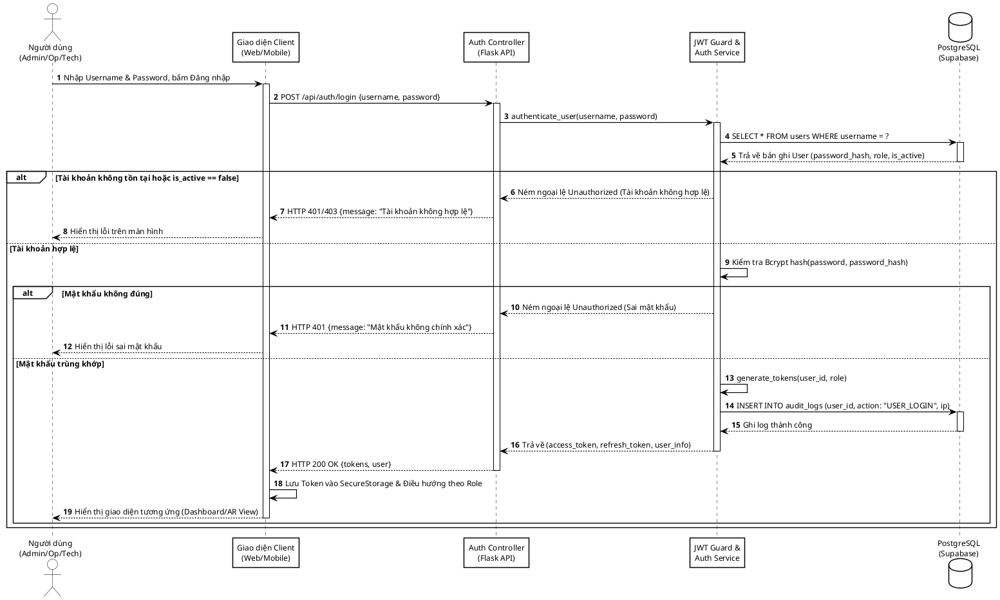
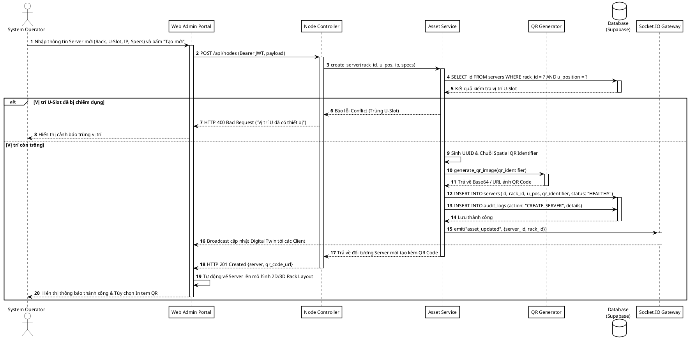
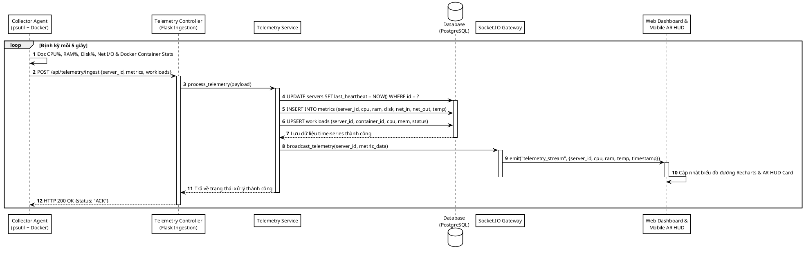
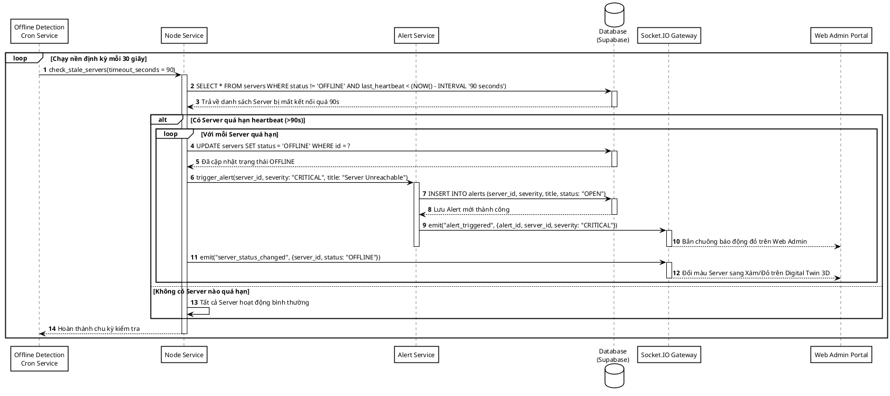
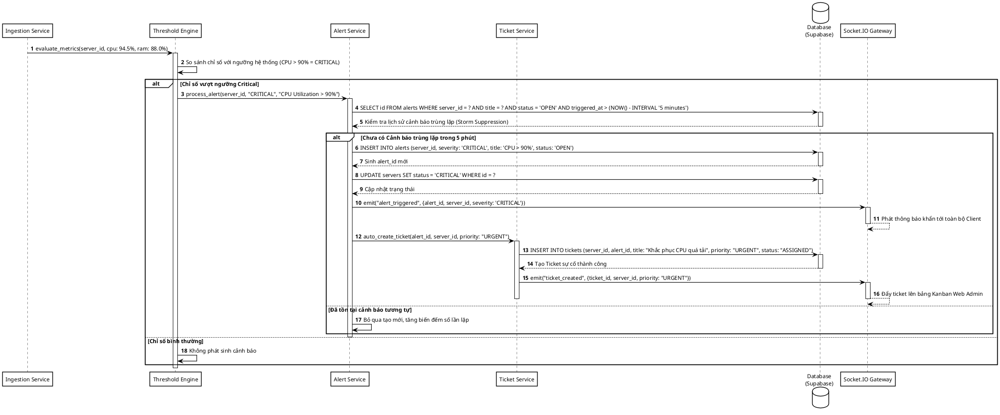
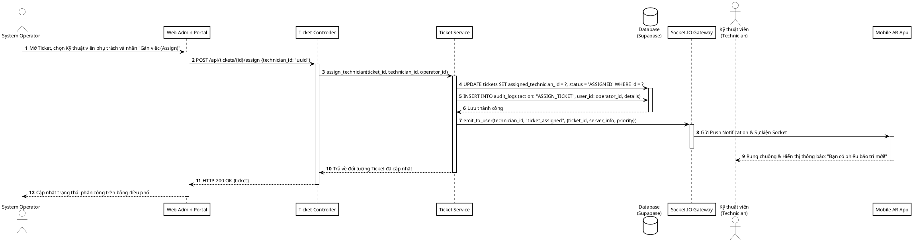
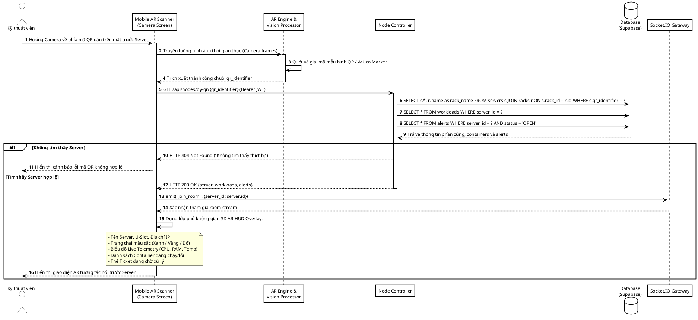
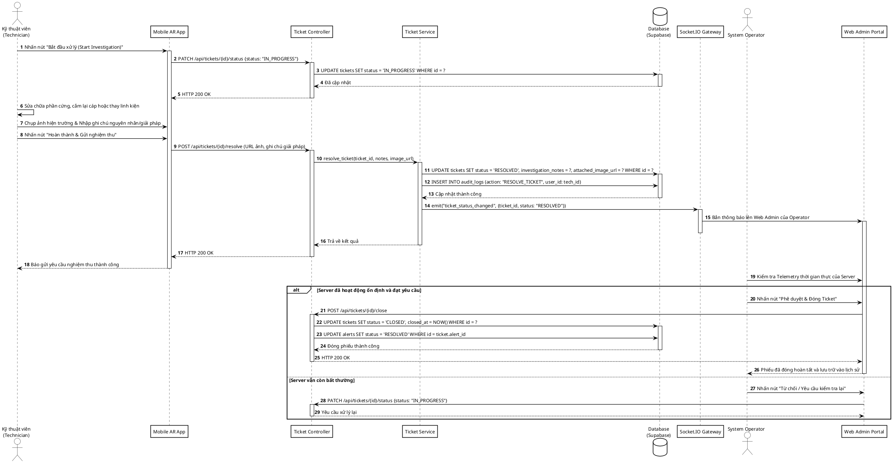
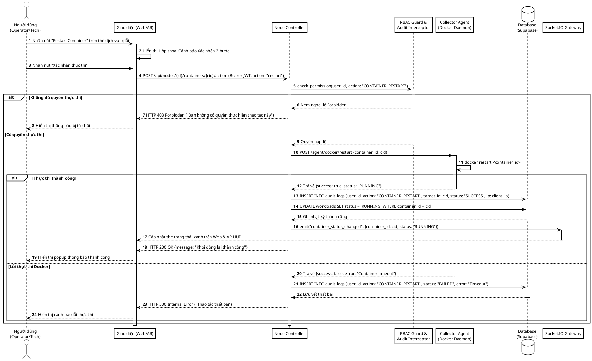
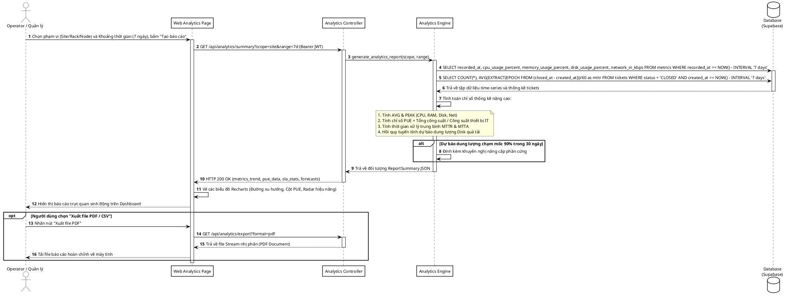

# TỔNG HỢP MÃ NGUỒN SEQUENCE DIAGRAM (PLANTUML CHUẨN KỸ THUẬT CHO DRAW.IO)
## HỆ THỐNG GIÁM SÁT VÀ BẢO TRÌ CƠ SỞ HẠ TẦNG TÍCH HỢP AR (AR-IMMS)

> **Phong cách vẽ:** Chuẩn kỹ thuật (Engineering / Clean Monochrome), **khung hộp vuông vắn (Sharp 90°)**, **đường kẻ thẳng đen nét**, không bóng đổ, có đánh số thứ tự bước (`autonumber`), phân khối kích hoạt (`activate/deactivate`) rõ ràng, tự nhiên và chuyên nghiệp khi import vào Draw.io.

---

### 📌 HƯỚNG DẪN IMPORT VÀO DRAW.IO:
1. Mở trang web [draw.io](https://app.diagrams.net/).
2. Trên thanh menu chọn: **Arrange** (Sắp xếp) -> **Insert** (Chèn) -> **Advanced** (Nâng cao) -> **PlantUML...**
3. Sao chép (Copy) toàn bộ đoạn mã trong khối `@startuml ... @enduml` của biểu đồ bạn muốn vẽ và dán vào ô nhập liệu.
4. Nhấn **Insert** (Chèn). Draw.io sẽ tự động dựng thành biểu đồ tuần tự hoàn chỉnh.

---

## MỤC LỤC CÁC BIỂU ĐỒ TUẦN TỰ (SEQUENCE DIAGRAMS)
- [SD-01: Quy trình Xác thực Người dùng & Cấp quyền JWT (Authentication & RBAC)](#sd-01-quy-trình-xác-thực-người-dùng--cấp-quyền-jwt)
- [SD-02: Quy trình Khai báo Máy chủ & Sinh mã Spatial QR (Asset Registration & QR Binding)](#sd-02-quy-trình-khai-báo-máy-chủ--sinh-mã-spatial-qr)
- [SD-03: Quy trình Thu thập Telemetry & Phát sóng Real-time (Telemetry Ingestion & Socket Stream)](#sd-03-quy-trình-thu-thập-telemetry--phát-sóng-real-time)
- [SD-04: Quy trình Phát hiện Máy chủ Mất kết nối (Heartbeat Timeout & Offline Alert)](#sd-04-quy-trình-phát-hiện-máy-chủ-mất-kết-nối)
- [SD-05: Quy trình Đánh giá Ngưỡng & Tự động Tạo Phiếu Sự cố (Threshold & Auto-Ticket Engine)](#sd-05-quy-trình-đánh-giá-ngưỡng--tự-động-tạo-phiếu-sự-cố)
- [SD-06: Quy trình Phân công & Điều phối Phiếu Bảo trì (Ticket Dispatching & Notification)](#sd-06-quy-trình-phân-công--điều-phối-phiếu-bảo-trì)
- [SD-07: Quy trình Quét Camera AR & Dựng HUD Không gian (AR Scanner & HUD Realtime)](#sd-07-quy-trình-quét-camera-ar--dựng-hud-không-gian)
- [SD-08: Quy trình Xử lý Sự cố Hiện trường & Nghiệm thu Đóng phiếu (On-site Ticket Resolution)](#sd-08-quy-trình-xử-lý-sự-cố-hiện-trường--nghiệm-thu-đóng-phiếu)
- [SD-09: Quy trình Điều khiển Từ xa An toàn & Ghi Nhật ký Kiểm toán (Safe Remote Action & Audit Trail)](#sd-09-quy-trình-điều-khiển-từ-xa-an-toàn--ghi-nhật-ký-kiểm-toán)
- [SD-10: Quy trình Báo cáo Hiệu năng, Dự báo Dung lượng & PUE (Analytics & Capacity Forecast)](#sd-10-quy-trình-báo-cáo-hiệu-năng-dự-báo-dung-lượng--pue)

---

### SD-01: Quy trình Xác thực Người dùng & Cấp quyền JWT

---

### SD-02: Quy trình Khai báo Máy chủ & Sinh mã Spatial QR

---

### SD-03: Quy trình Thu thập Telemetry & Phát sóng Real-time

---

### SD-04: Quy trình Phát hiện Máy chủ Mất kết nối

---

### SD-05: Quy trình Đánh giá Ngưỡng & Tự động Tạo Phiếu Sự cố

---

### SD-06: Quy trình Phân công & Điều phối Phiếu Bảo trì

---

### SD-07: Quy trình Quét Camera AR & Dựng HUD Không gian

---

### SD-08: Quy trình Xử lý Sự cố Hiện trường & Nghiệm thu Đóng phiếu

---

### SD-09: Quy trình Điều khiển Từ xa An toàn & Ghi Nhật ký Kiểm toán

---

### SD-10: Quy trình Báo cáo Hiệu năng, Dự báo Dung lượng & PUE

